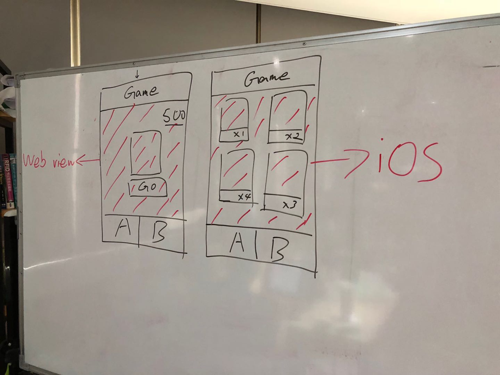

# 抽卡牌挑戰賽

## Host

Howard / Don

## Members

iOS / Web Camp

- Team A: Andy / Jeremy / Iris
- Team B: 菘駿 / Morris / Mickey
- Team C: Andy / Jason / Ethan

## 任務描述

這一次，我們需要快速的生出一個能夠通過消費代幣來抽卡牌的 App。

利用起現有的資源來進行 App 開發，Web 工程師負責抽卡的邏輯， App 負責介面和存儲的邏輯。

但你們只能通過 WebView 來溝通。

### Web 

- 將前一次的挑戰賽的抽卡動畫，實作成「隨機抽卡」應用，每一次使用者點「抽卡」都能夠隨機獲得一張卡片。
- 抽卡動畫右上方顯示使用者的餘額。

### iOS

- 將 Web 所做的抽卡應用整合到 iOS App 當中（通過 WebView 操作）.
- 呈現目前使用者已經抽到的卡片。
- 通過 Tab 切換兩個畫面。

### 其他

- 為你的遊戲取名字
- 抽卡需要消耗代幣、餘額不足要跳提示並防止繼續抽卡。
- 餘額和卡片資料要永久存儲（強關 App 在打開，要能還原資料）

### 時間

- 17:00 截止。

