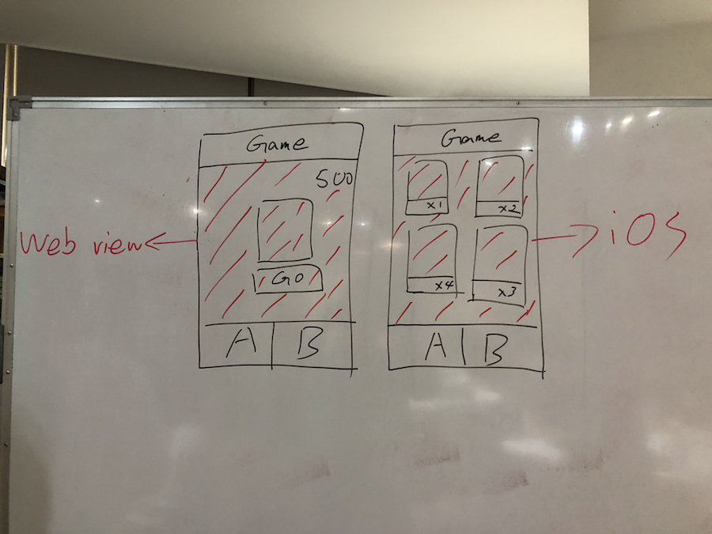

#  Card Game (team work II)

今日挑戰賽，抽卡創業挑戰賽。

今天讓大家體驗創業會碰到的兩個元素
如何用最小的成本去測試商業模式。
和時間賽跑。

Web: 將昨天的「抽卡動畫」改為「隨機抽卡系統」
iOS: 實作抽卡 App, 消耗代幣抽卡、顯示已抽到的卡牌。
Web 與 App 將通過 Webview 溝通。

其他描述我現場畫白板。

* Team A: @andy / @Jeremy / @Iris Tsai /
* Team B: @菘駿 / @Morris  / @mickey
* Team C: @Arel / @Ethan / @Jason

驗收：
通過消耗代幣進行抽卡的 App
抽卡動畫由 Web 完成
資料需要存到 sandbox 中（重啓 App 要有資料）

時間：
下午五點截止。

=====================================================

這次有點可惜，挑戰賽沒能在下午五點以前完成
最後還是花了一些時間完成了，效果如下

